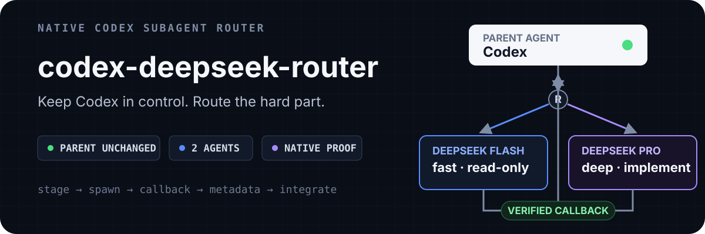
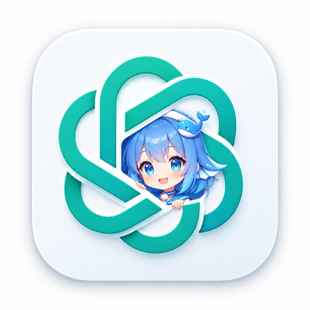

<p align="center">
  
</p>

<p align="center">
  
</p>

<p align="center"><a href="README.md">简体中文</a> · <strong>English</strong></p>

<p align="center">
  <a href="https://github.com/TheBlindM/codex-deepseek-router/actions/workflows/ci.yml"></a>
</p>

> Codex always remains the parent agent. It selects `deepseek_flash` or
> `deepseek_pro` by task, delegates through native `spawn_agent`, then verifies
> and integrates the result itself.

## The outcome first

| Parent stays intact | Two specialized agents | Evidence, not self-report |
| --- | --- | --- |
| Never touches `config.toml`; the parent model, provider, and ChatGPT login stay unchanged | Flash handles fast read-only exploration; Pro handles deep reasoning and implementation | Native callback, thread-database metadata, and a random challenge marker must all agree |

This is not a daemon, proxy, MCP server, or second agent runtime. It is a
managed set of native Codex configuration: two agents, one model catalog, one
plaintext handoff hook, one runtime routing skill, and one transactional
manager.

## Quick start

Requirements: Node.js/npm, Python 3.9+, the Codex desktop app started at least
once, and a DeepSeek API key.

### 1. Install the Plugin

```bash
codex plugin marketplace add TheBlindM/codex-deepseek-router
codex plugin add codex-deepseek-router@deepseek-router
```

`deepseek-router` is the real Marketplace name declared in
`.agents/plugins/marketplace.json`; it is not a placeholder.

The Plugin provides the management Skill, routing Skill, and native Hook. It
does not write a Hook into `~/.codex/hooks.json`.

### 2. Configure it inside Codex

Restart Codex, open a new task, and ask:

```text
Install and configure codex-deepseek-router for me.
```

The Skill checks current state first. If no credential exists, Codex asks for
the API key and passes it to the manager through stdin only; the key never
enters command arguments, configuration files, or chat echo.

### 3. Review and verify

1. Restart Codex or start a new task and review/trust the Hook in Codex's native
   Plugin Hook UI.
2. Ask Codex to run the live router test; Flash and Pro must pass separately.
3. If the review prompt is not shown by the current Codex version, use `/hooks`
   in the interactive CLI as a fallback.

Then use it naturally:

```text
Use the DeepSeek agents to review this repository.
```

## How it works

```text
User task
   │
   ├─ Modality gate: TEXT_ONLY / VISION_TRANSLATABLE / VISION_CRITICAL
   ├─ Sensitivity gate: secrets and sensitive context stay in Codex
   ├─ Model router: Flash / Pro / no delegation
   └─ Policy router: FAST / REACT / SPEC / DEEP
            │
            ▼
stage → SubagentStart hook → DeepSeek child
            │
            ▼
native callback → metadata + marker verification → Codex integration
```

### Who does what

| Target | Best for | Boundary |
| --- | --- | --- |
| `deepseek_flash` | Search, enumeration, logs, extraction, code maps, high-volume reading | Read-only; returns change proposals instead of editing files |
| `deepseek_pro` | Root cause, architecture, concurrency, security, complex review, cross-module implementation | Workspace-write; lands work that needs deep reasoning |
| Codex parent | Trivial work, sensitive context, critical visual judgment, final verification and integration | Always keeps control |

Flash can return `ESCALATE_TO_PRO` with an Evidence Packet so Pro continues
from collected evidence instead of scanning the repository again. FAST / REACT
/ SPEC / DEEP are bounded decision contracts, not extra models or runtimes.

## Installed components and safety boundaries

The manager:

- installs `deepseek-flash.toml` and `deepseek-pro.toml` together;
- registers both models in `~/.codex/models.json`;
- exposes `skills/` and `hooks/hooks.json` from the Plugin; Hook commands use
  `PLUGIN_ROOT` and never depend on a user's cwd or absolute paths;
- configures only credentials, Agents, the model catalog, and explicit fallback runtime;
- stores the key in the system credential store and rolls back every managed change on failure;
- never changes the parent's `config.toml` or forges hook trust.

On macOS, the same Python executable identity reads and writes Keychain through
Security.framework. `status` and `doctor` check item existence without
decrypting the key or repeating authorization, and user-facing replies follow
the language of the user's current request.

DeepSeek children receive text only. Codex must translate screenshots, images,
and video into textual facts first; critical visual judgment stays with Codex.
On Windows, agents authenticate through the user-level `DEEPSEEK_API_KEY`
environment variable and require a full Codex restart after it is set.

## Manager commands

| Command | Purpose |
| --- | --- |
| `status` | Read-only runtime, agent, catalog, credential, and hook state |
| `setup` | Install every component idempotently and transactionally |
| `test` | Run independent native dispatch proofs for Flash and Pro |
| `repair` | Recover after parent-model upgrades, Codex updates, or drift |
| `migrate` | Precisely remove a legacy Skill-first global Hook without touching unrelated Hooks |
| `disable` | Record disabled intent; Plugin Hook lifecycle remains owned by Codex |
| `uninstall` | Remove project-owned content; keep the API key by default |
| `doctor` | Diagnose the environment, hook trust, and handoff state |

Every command accepts `--json` and `--codex-home`. Exit codes: `0` means
ready/configured, `2` means user action is required, `3` means timeout, and `1`
means an unexpected failure.

<details>
<summary><strong>Install from source and verify manually</strong></summary>

```bash
git clone https://github.com/TheBlindM/codex-deepseek-router.git
cd codex-deepseek-router
python3 scripts/codex_deepseek_router.py status --json
```

Pass the key through stdin only:

```bash
printf '%s\n' '<your-key>' | python3 scripts/codex_deepseek_router.py setup --api-key-stdin --json
```

After Codex's native Plugin Hook review (or the CLI `/hooks` fallback), run the live proof:

```bash
python3 scripts/codex_deepseek_router.py test --json
```

`test` proves the expected `model_provider`, model, and agent role for each
child and verifies an independent random marker. Flash passing never implies
Pro passing.

</details>

## Documentation

- [Architecture](references/architecture.md) ·
  [routing policy](references/routing-policy.md) ·
  [multimodal boundary](references/multimodal.md)
- [Compatibility](references/compatibility.md) ·
  [security](references/security.md) ·
  [troubleshooting](docs/troubleshooting.md)
- [Design decisions](docs/architecture.md) · [evaluation](docs/eval.md) ·
  [upstream source map](docs/upstream-reference-map.md)

## Development and verification

```bash
python3 -m venv .venv
.venv/bin/pip install pytest
.venv/bin/python -m pytest -q
```

Tests cover manager lifecycle and rollback, the handoff protocol, cross-role
isolation, router contracts, schema validation, and credential-leak scanning.
CI runs on Windows, macOS, and Linux across Python 3.9/3.11/3.12. Live
DeepSeek calls intentionally stay out of CI.

## Acknowledgements

- [oil-oil/codex-deepseek-subagent](https://github.com/oil-oil/codex-deepseek-subagent)
  established the manager, transactional rollback, system credentials,
  runtime discovery, and native verification foundation.
- [Utopia-V/codex-deepseek-subagent](https://github.com/Utopia-V/codex-deepseek-subagent)
  provided the foundation for the plaintext `SubagentStart` handoff transport.
- [yjh051108/dsh-routing-suite](https://github.com/yjh051108/dsh-routing-suite)
  inspired the bounded, task-aware reasoning-policy router.

Thank you to their authors and contributors for publishing implementation,
experiments, and design reasoning. Exact adaptations, source mapping, and
license notices live in [NOTICE.md](NOTICE.md) and the
[upstream source map](docs/upstream-reference-map.md).

## License

MIT — see [LICENSE](LICENSE).
